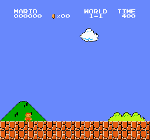
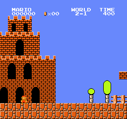
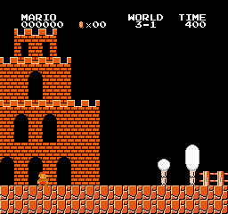

# jev-mario

[TypeSafe Jev](https://typesafe.ai) plays Super Mario Bros from the emulator's RAM. Three harnesses, each with a deterministic control.

| 1-1 | 2-1 | 3-1 |
|---|---|---|
|  |  |  |

## Results

`x` is distance reached; the flag is at about x = 3160. One life per run.

**Branching** (`branch.py`). Every option is played in the emulator for one second plus two follow-up moves, from a snapshot. Jev chooses among the measured outcomes. `--bot search` chooses by (alive, not a dead end, distance) with no API call.

| level | Jev | search |
|---|---|---|
| 1-1 | flag | 2370 |
| 2-1 | flag ¹ | 2066 |
| 3-1 | flag ¹ | 2786 |

¹ On earlier builds of `branch.py` (runs `2-1-branch-jev-20260918-155948`, `3-1-branch-jev-20260918-144804`). The current build reaches 2066 on 2-1 and 2770 on 3-1; each stall is a spot where no move in the option set survives three seconds, and the stalls differ by build because the option set does.

Jev takes 25–35 calls and under $0.002 per level, with 15–20 minutes of emulation per level.

Any server speaking the same contract can be substituted with `--url`. Two open models trained on the System One format were run on 1-1 through the same harness. `p` is the mean probability on the option taken, against 0.09 for a uniform choice over the 11 options.

| model | 1-1 | calls | median latency | p |
|---|---|---|---|---|
| Jev | flag | 23 | 0.38 s | 0.62 |
| [Kev-0.8B](https://huggingface.co/jaredpalmer/kev-0.8b) | 1672 | 15 | 2.89 s | 0.20 |
| [Laya](https://huggingface.co/convaiinnovations/laya) | 1139 | 10 | 0.75 s | 0.54 |

The harness simulates every option and passes the measured outcome, so the only task left is ranking eleven descriptions. Kev ranks them slightly better than chance and drifts right until it takes a backward move at x = 1440. Laya is confident and wrong: it opened with `stand`, then `walk left` at 0.93, then `jump in place` three times. Its checkpoint sets a temperature of 0.10 for choices of 11 or more options against 1.0 to 2.0 for smaller ones, so its probabilities are sharp here regardless of the pick.

**Direct control** (`play.py`). One action every 6 frames from a text summary; the emulator pauses during the call. `--bot rules` is the same rules as an if-chain.

| level | Jev, 3 runs | rules | hold "run and jump" |
|---|---|---|---|
| 1-1 | 686, 686, 686 | 1129 | 1526 |
| 2-1 | 473, 473, 473 | 741 | 476 |
| 3-1 | 607, 754, 841 | 608 | 775 |
| 4-1 | 339, 339, 1305 | 1827 | |
| 5-1 | 305, 439, 439 | 271 | |

**Live speed** (`live.py`). JSON state, a Choice plus a Noul plus a Score combined in code, no pause: the emulator advances by the measured latency while the request is in flight. The rules twin gets the same 0.2 s delay.

| level | Jev, 3 runs | rules |
|---|---|---|
| 1-1 | 315, 315, 315 | 315 |
| 2-1 | 451, 453, 457 | 471 |
| 3-1 | 408, 423, 596 | 515 |

## Run

```bash
cp .env.example .env        # TYPESAFE_API_KEY
uv sync
uv run python branch.py --bot jev --level 1-1
uv run python branch.py --bot jev --levels 1-1,2-1,3-1 --attempts 2
uv run python branch.py --bot jev --level 1-1 --url http://127.0.0.1:8010/v1/systemone --label laya
uv run python play.py --bot jev --level 1-1
uv run python live.py --bot jev --level 1-1
```

Each run writes `runs/<level>-<mode>-<bot>-<stamp>.gif`, a per-decision log beside it, and one line to `runs/results.jsonl`.

## Notes

- `play.py` holds the shared parts: RAM to tile grid (`grid`), grid to fields and summary (`features`), the rules policy (`policy`), jump physics measured in this emulator (`JUMP_TABLE`, `HOP_TABLE`), and the three blocks marked `EDIT HERE`.
- `play.py --inspect <log> -n 3` prints the last decisions with state, grid and probabilities. `play.py --bot "replay:<log>@N:<action,...>"` replays N logged choices then holds the tail, without API calls.
- Snapshot/restore is nes-py's `_backup`/`_restore`; it has one slot, so continuations are replayed from the root. Restore was verified exact over 240 frames.
- RAM: x = `0x6D:0x86`, y = `0x3B8`, horizontal speed = `0x57`, airborne = `0x1D`, screen x = `0x3AD`, tiles at `0x500` (two 16×13 pages), enemy slots `0x0F`–`0x13` with type at `0x16+i`. Verified types: 6 goomba, 0 green koopa, 13 piranha plant, 14 flying koopa.
- Frame-exact moves (`RAW` in `branch.py`) were found by probe and fail if shifted by one frame.
- `branch.py --url` sends the request elsewhere. The bearer token and the cost figure apply to the TypeSafe endpoint only, and `usage.input_tokens` is optional in the response. The Laya and Kev servers used above are `evaljev.serve` in [jev-eval](https://github.com/4esv/jev-eval) and `kev.serve` in the Kev repo.
- Wall time per decision is dominated by the emulator, which plays 11 options and 36 continuations from a snapshot. Model latency changes the total by minutes, not by an order of magnitude.
- Emulator: `gym-super-mario-bros` with `nes-py`, pinned to `numpy<2` and `gym==0.26`.
