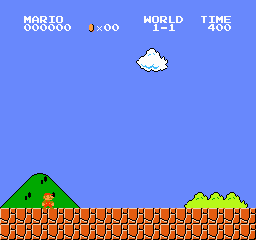
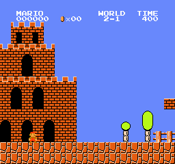

# jev-mario

[TypeSafe Jev](https://typesafe.ai) plays Super Mario Bros from a text description of the emulator RAM. Three harnesses, one deterministic control for each.

| 1-1 | 2-1 | 3-1 |
|---|---|---|
|  |  |  |

`x` is distance reached; the flag is at about 3160. One life per run.

## Branching (`branch.py`)

Every option is simulated in the emulator for one second plus two follow-up moves (snapshot/restore). Jev picks from the measured outcomes. `--bot search` picks by (alive, not a dead end, distance) with no API call.

| level | Jev | search |
|---|---|---|
| 1-1 | flag | 2370 |
| 2-1 | 2066 (flag on the previous build) | 2066 |
| 3-1 | flag | 2786 |

25–35 calls and under $0.002 per level. 15–20 minutes per level of emulation.

## Direct control (`play.py`)

Jev picks a controller action every 6 frames from a text summary of the state; the emulator pauses during the call. `--bot rules` is the same rules as an if-chain.

| level | Jev, 3 runs | rules | hold "run and jump" |
|---|---|---|---|
| 1-1 | 686, 686, 686 | 1129 | 1526 |
| 2-1 | 473, 473, 473 | 741 | 476 |
| 3-1 | 607, 754, 841 | 608 | 775 |
| 4-1 | 339, 339, 1305 | 1827 | |
| 5-1 | 305, 439, 439 | 271 | |

## Live speed (`live.py`)

JSON state, a Choice plus a Noul plus a Score combined in code, and no pause: the emulator advances by the measured latency while each request is in flight. The rules twin gets the same 0.2 s delay.

| level | Jev, 3 runs | rules |
|---|---|---|
| 1-1 | 315, 315, 315 | 315 |
| 2-1 | 451, 453, 457 | 471 |
| 3-1 | 408, 423, 596 | 515 |

## Run

```bash
cp .env.example .env        # TYPESAFE_API_KEY=...
uv sync
uv run python branch.py --bot jev --level 1-1
uv run python branch.py --bot jev --levels 1-1,2-1,3-1 --attempts 3
uv run python play.py --bot jev --level 1-1
uv run python live.py --bot jev --level 1-1
```

Each run writes a GIF and a per-decision log to `runs/` and a line to `runs/results.jsonl`. `play.py --inspect <log>` prints the last decisions; `play.py --bot "replay:<log>@N:<action>"` replays N logged choices and then holds an action, without API calls.

Emulator: `gym-super-mario-bros` with `nes-py`, pinned to `numpy<2` and `gym==0.26`. Jump physics, RAM offsets and the frame-exact moves are documented in comments where they are used.
