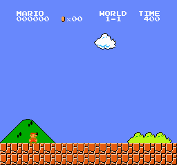

# jev-mario

[Jev](https://typesafe.ai) is a text-only decision model. It cannot see pixels. This script lets it play Super Mario Bros 1-1 anyway, by reading the emulator's RAM, describing the situation in words, and asking Jev which button to press. Every 6 frames it gets a decision back in about 180 ms.



## Results

All runs are on world 1-1, one life, and end at death, at the flag, or after 6 game-seconds without progress. `x` is how far right Mario got. The flag is at about x=3160.

| player | runs | x reached | calls per run | cost per run |
|---|---|---|---|---|
| hold "run and jump" (scripted) | 1 | 724 | 0 | $0 |
| alternate jump / run (scripted) | 1 | 677 | 0 | $0 |
| Jev, final harness | 6 | 687, 687, 687, 759, 769, 839 (median 723) | 22 to 42 | under $0.002 |
| Jev, previous harness (no enemy guard in the macro) | 3 | 2025, 769, 687 | 22 to 89 | under $0.004 |

So Jev plays about as well as a bot that holds two buttons, with one run that went three times further. Nine runs cost five cents in total.

What Jev does well is pick the right action for what the state describes. It ran, jumped at goombas, and chose "running jump at the obstacle ahead" at the pipes. What it cannot do is plan. Each call is a reflex with no memory. When the run-up for a tall pipe was described as a three-step rule, it walked back correctly and then picked "walk right" instead of "run right" at 0.5 probability, and oscillated in front of the pipe for the rest of the run. The fix was to give it a macro action that the harness executes, and let Jev decide when to use it.

Four of the nine recent runs died identically at x=687. That is a bug in the macro, which walks Mario backwards into a goomba, not a Jev decision.

## How the state is fed

Jev's docs say to send structured program state, not raw data. Three things were tried.

An ASCII grid of tiles around Mario. Jev ran straight into the first pipe and never jumped. It does not read a grid as a picture.

Derived fields with a one-sentence summary, such as `A solid wall 4 tiles tall is 1 tile ahead. There are 4 tiles of clear ground behind Mario for a run-up. No enemy ahead. Mario is on the ground, standing still.` This worked immediately. The grid is still sent as a secondary field.

A hex dump of RAM was not tried, because Jev is trained on text and the bytes carry nothing it can score against.

Each call sends the summary, the fields, the grid, and the previous action, and asks one `choice` question with 8 options. That is about 850 input tokens, or 0.004 cents.

## Run it

```bash
cp .env.example .env            # TYPESAFE_API_KEY=...
uv sync
uv run python play.py --bot jev
uv run python play.py --bot "run and jump right"   # scripted baseline
uv run python play.py --bot jev --dump              # print what Jev would see, no API calls
```

Each run writes a GIF and a log of every decision to `runs/`, and appends a line to `runs/results.jsonl`.

The emulator is `gym-super-mario-bros`, which ships the ROM inside the package. It needs `numpy<2` and `gym==0.26`, both pinned.
