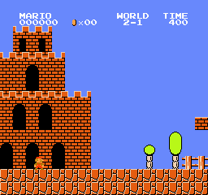
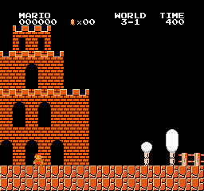

# jev-mario

[Jev](https://typesafe.ai) is a text-only decision model. This harness has it play Super Mario Bros by reading the emulator RAM, describing the situation in text, and asking for a joypad action every 6 frames.

| 1-1 | 2-1 | 3-1 |
|---|---|---|
|  |  |  |

## Results

One life per run. A run ends at death, at the flag, or after 6 game-seconds without progress. `x` is horizontal distance reached; the flag is at about x=3160 on each level. Jev was not adjusted between levels.

| level | Jev (3+ runs) | hold "run and jump" (scripted) | alternate jump / run (scripted) |
|---|---|---|---|
| 1-1 | 687, 687, 687, 759, 769, 839 | 724 | 677 |
| 2-1 | 417, 417, 507 | 532 | 530 |
| 3-1 | 574, 574, 591 | 420 | 419 |

Jev runs used 22–42 API calls each, under $0.002 per run, with a median decision latency of 180 ms.

Jev selects the correct action for the described state, including a multi-step "running jump" macro at pipes. It does not carry a plan across calls; multi-step behaviour has to be packaged as a single action and executed by the harness. Repeated identical scores are repeated identical deaths: given the same state sequence, its choices are nearly deterministic.

Known issue: the macro's run-up is only guarded against the nearest enemy. Most deaths on all three levels are the macro running into a second enemy.

## State

Each call sends:

- a one-sentence summary, e.g. `A solid wall 4 tiles tall is 1 tile ahead. There are 4 tiles of clear ground behind Mario for a run-up. No enemy ahead. Mario is on the ground, standing still.`
- the same information as fields (`wall_ahead`, `gap_ahead`, `enemy_ahead`, `clear_behind`, `on_ground`, `speed`)
- a 13×16 tile grid around Mario
- the previous action

and asks one `choice` question with 8 options. About 850 input tokens per call.

The grid alone was not sufficient: with only the grid, Jev did not jump at the first pipe. The derived fields resolved this.

## Run

```bash
cp .env.example .env            # TYPESAFE_API_KEY=...
uv sync
uv run python play.py --bot jev --level 2-1
uv run python play.py --bot "run and jump right" --level 2-1   # scripted baseline
uv run python play.py --bot jev --dump                          # print the state without calling the API
```

Each run writes a GIF and a per-decision log to `runs/` and appends a line to `runs/results.jsonl`.

Emulator: `gym-super-mario-bros` with `nes-py`, pinned to `numpy<2` and `gym==0.26`.
