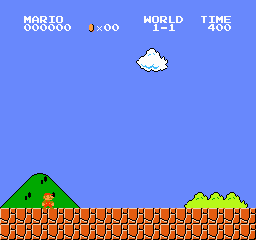
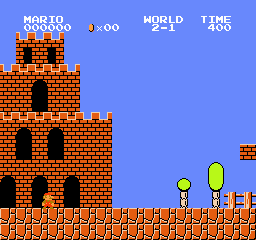
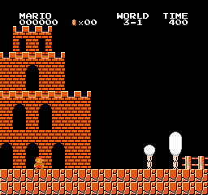

# jev-mario

[Jev](https://typesafe.ai) is a text-only decision model. This harness has it play Super Mario Bros by reading the emulator RAM, describing the situation in text, and asking for a joypad action. Jev chooses every action; the harness only executes it (a jump is held until Mario lands) and describes the result.

| 1-1 | 2-1 | 3-1 |
|---|---|---|
|  |  |  |

## Results

One life per run. A run ends at death, at the flag (x ≈ 3160), or after 6 game-seconds without progress. Jev was not adjusted between levels.

| level | Jev, 3 runs (x reached) | hold "run and jump" (scripted) |
|---|---|---|
| 1-1 | 1515, 1515, 1960 | 1786 |
| 2-1 | 297, 471, 471 | 476 |
| 3-1 | 608, 717, 805 | 775 |

Jev runs used 6–27 API calls each, under $0.002 per run, at a median latency of about 180 ms per decision.

Jev's choices track the state description closely. Every recorded death traced back to something the description got wrong or left out, not to Jev choosing against it: a landing check that misread overhead blocks as ground, an enemy scan limited to ground level (a piranha plant on a pipe was invisible), a lookahead shorter than a full jump, jumps cut short by blocks overhead. Each fix moved the death further along. The play quality is bounded by the description of the game's physics, which is hand-written.

Runs are nearly deterministic: the same state sequence produces the same choices, so a repeated score is a repeated death.

## State

Each call sends a summary, the fields it is built from, a 13×20 tile grid, and the previous action, and asks one `choice` question with 9 options. About 950 input tokens per call.

The summary is templated from RAM. Example:

`A solid wall 4 tiles tall is 3 tile(s) ahead. There are 0 tiles of clear ground behind Mario for a run-up. Solid ground ahead. Enemies: 7 tiles ahead and 2 tiles up (on top of something); 9 tiles ahead at ground level. Mario is on the ground, standing still. A jump from this speed clears 4 tiles high and 3 tiles far; at full running speed it clears 5 high and 9 far. Start the jump when the wall is about 1 tiles ahead. A jump right now would land about 3 tiles ahead, on clear ground.`

The jump numbers were measured in the emulator: height depends on how long A is held (2.4 tiles at 6 frames, 4.0 held to landing); distance depends on horizontal speed (3.3 tiles from rest, 5.1 walking, 9.1 running). Speed is RAM 0x57, airborne is RAM 0x1D.

## Run

```bash
cp .env.example .env            # TYPESAFE_API_KEY=...
uv sync
uv run python play.py --bot jev --level 2-1
uv run python play.py --bot "run and jump right" --level 2-1   # scripted baseline
uv run python play.py --bot jev --dump                          # print the state without calling the API
uv run python play.py --bot "replay:runs/<log>.jsonl:jump right,run right"   # replay a log, then hold actions
```

Each run writes a GIF and a per-decision log (state, grid, probabilities) to `runs/` and appends a line to `runs/results.jsonl`.

Emulator: `gym-super-mario-bros` with `nes-py`, pinned to `numpy<2` and `gym==0.26`.
